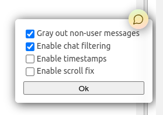
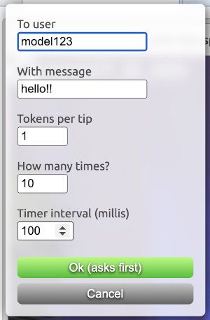

# 💬 Chaturbate Chat Utils and AutoTipper
This is a script meant for [Tampermonkey](https://www.tampermonkey.net/) (or any compatible extension).
It allows filtering or graying out non-user messages (e.g. tip menus, join notifications, follow notices...)
and adding timestamps to messages in real time.

This script should (_should_) get autoupdated from this repository,
if you have enabled automatic updates.

### **Important!**
**You use this userscript at your own risk. Please read Chaturbate's terms of service and use your own judgement whether or not to use this script.**
The programmer of this script is not responsible for any bans or other forms of punishments that may be issued to users, especially when using features such as the autotipper.

---

## How to install
1. Install [Tampermonkey](https://www.tampermonkey.net/) or any compatible userscript manager
2. Import the userscript either by
    - opening [cb-chat-utils.js](cb-chat-utils.js) and copypasting it into a new userscript, or
    - importing the raw url [https://raw.githubusercontent.com/sumaeq/cb-chat-utils/main/cb-chat-utils.js](https://raw.githubusercontent.com/sumaeq/cb-chat-utils/main/cb-chat-utils.js)

If you want to get automatic updates, usually you have to enable them from the extension settings. However, since this userscript runs on a site with virtual currency, I highly suggest not to enable autoupdates, and instead check the code yourself before copypasting it.

---

## Settings and usage

The script adds a "chat balloon" to room pages.
It can be dragged around the window to prevent obstructing anything below it.
By clicking on the "balloon", a simple dialog of options is presented.

### Gray out non-user messages
This will gray out (change the opacity and set filter to grayscale(100%)) on any messages that aren't related to a user (e.g. notices). Useful if you want to still see tip menus and notices, but keep your focus on chat messages (especially useful for models and mods!)

### Enable chat filtering
This will hide the messages mentioned above. Useful if you want to hide tip menus and useless notices from the chat completely to only see tips and chat messages (there is also a rule for basic tip menu item parsing, which allows messages containing the words "tipped for").

### Enable timestamps
This will prepend basic HH:MM:SS timestamps to all messages and notices. Useful if you go AFK and want to see when a message was written to the chat. (Only works when you are in the room)

### Enable scroll fix
This will just brutely scroll the chat box to the bottom whenever a new message is appended, to fix scroll lag caused by timestamps and other added stuff.

## Autotipper

The autotipper can be used to repeatedly tip an amount of tokens to the same model.
The options are as follows:
- **To user** - the exact username of the model to tip to (usually autofilled if the URL doesn't have extra parameters)
- **With message** - the tip message, leave empty to not send a message
- **Tokens per tip** - the amount of tokens to tip on every loop
- **How many times?** - the repeat count
- **Timer interval (millis)** - the interval between the loops in milliseconds, e.g. 500 = two tips per second, 100 = 10 tips per second

Launch the autotipper by first clicking on the "chat bubble", and then clicking on the purple "Launch autotipper" button (not visible in the older screenshot above).

---

## License
This script is licensed under the MIT license.
Even though this script is mainly meant for my personal use,
feel free to fork or send pull requests for fun or useful additions.
